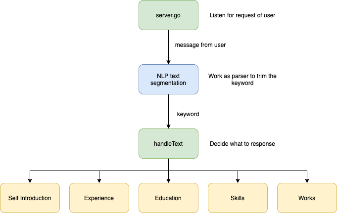

# Preassessment for LINE


Assignment for Line, which promote myself through chatbot.

## How to operate


1. Scan this QR code or search ```@458pivlz``` to add LINE Friend .

2. Follow the instruction of dialog or richmenu.

3. Input any string to test the different reaction.

## Structure



## How to develop

First, you can install the project by cloning the repo:

```zsh
git clone https://github.com/JamesHsu333/Line-preaccessment.git
```
Then, create ```.env``` and complete it with the ```CHANNEL_TOKEN``` and ```CHANNEL_SECRET``` from LINE Developers console:


```zsh
CHANNEL_SECRET=YOUR CHANNEL SECRET
CHANNEL_TOKEN=YOUR CHANNEL TOKEN
PORT=PORT YOU PREFER
```

Thus, install the dependencies and start the app:
```zsh
go install .
go run server.go message.go constant.go
```

Use ngrok or proxy to redirect localhost with https, then update the ```Webhook URL``` from LINE Developers console with:
```
https://(YOUR IP)/callback
```

## How to deploy